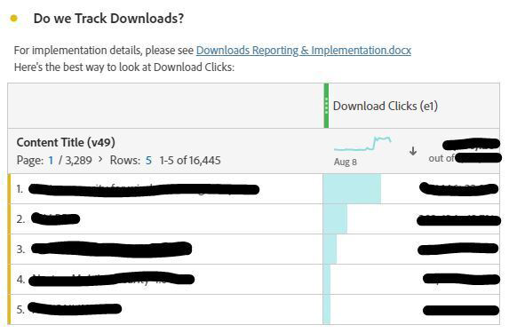

# 在Analysis Workspace中创建操作功能板

_探索Adobe Analytics工作区中的运营功能板如何彻底改变沟通和效率。 了解如何创建常见问题解答、新闻和公告以及Bug &amp; Features功能板，以简化信息、改善用户体验并提高参与度。_

与许多管理员一样，我为Adobe Analytics运行内部信息中心（Confluence或类似工具）。 随着时间的推移，我厌倦了重复回答同样的问题，需要以一种更顺畅的方式与用户沟通，而不是感觉自己一直在催促和烦扰他们。 我需要存储库来获取不那么静态的信息。

我注意到用户经常忽略我对Confluence网站的引用，例如“我的VPN已关闭”或“我现在无法阅读”等。 基本上，“我待会再看那份文件”意味着它永远不会被阅读，同样的问题将在下周被再次提问。

***实现点击：**工作区的多功能性可能会改变游戏规则。 用户更喜欢在工作区中快速、直接地获得答案，因此我们在工作区中保留它们，以避免额外的步骤。*

我着手创建运营功能板，以便在公司内共享。 到目前为止，它们一直让用户了解信息、集中信息，并减少了用户的不满。 这是一个简单、不断演变的过程，随着时间的推移提高了效率。

人们可以在没有我的情况下获取大量有用信息，了解网站区域，了解Adobe Analytics有多酷，并且(这对我??很重要)问我更少的问题，节省我的时间。

**我强烈建议您为网站的所有属性或主要区域创建功能板。** 他们应该提供资产/站点/应用程序/流的概述，并提供基本信息和快速见解。 这些资料应与整个公司共享，使所有用户无需任何牵手即可了解财产。 对我来说，这些仪表板通常能回答我收到的80%的问题，为我节省宝贵的时间。

所有这些都不会阻止您保留Confluence网站，保留它仍将非常有用。 我甚至会在每个操作仪表板的顶部引用它。 但我喜欢捷径 — 既为我自己，也为我的用户。

让我带大家看一下我为我的公司GenDigital创建的三个运营功能板，它们帮助我实现了这些目标。

1. 常见问题解答
1. 新闻与公告
1. 错误、功能和主要版本日志

## 1 — 常见问题解答信息板*

厌倦了无休止地重复答案？ Stop! 通过制作常见问题仪表板来节省时间。 用户可以在询问前查阅它，或者您可以在响应中快速链接到它。

只需创建 [文本可视化图表](https://experienceleague.adobe.com/docs/analytics/analyze/analysis-workspace/visualizations/text.html) 如果问题格式化为标题，答案/解释为内容，则全部折叠以仅显示问题。 按相关性（例如，页面或产品）或使用面板对它们进行分组。 保持简单，在顶部优先处理常见查询。

请更新您的常见问题仪表板，而不是写长电子邮件或重新发现旧的解释。 立即开始，随时间推移展开。 使用超链接在报表中引用其他功能板或相关常见问题解答。 需要时，通过从其他功能板链接到常见问题解答，提供复杂的上下文。

对于Gen Digital，我们的常见问题解答侧重于自定义Adobe Analytics使用，而不是基础知识。 通过右键单击、选择“获取可视化图表链接”并共享虚URL，可发送电子邮件给特定的常见问题链接。 这会为用户突出显示确切的内容。 使用自由格式表进行数据说明，添加更多带有“编辑说明”的解释。

一旦您的常见问题解答变得全面后，请与公司分享以供集体访问和学习。 根据需要保持增强。

下面是常见问题功能板的一些屏幕截图：

## 2 — 新闻和公告仪表板

另一个有用的操作仪表板是新闻和公告仪表板。 我开始这个是因为我想向我的用户发布信息，但我感觉自己反而是在骚扰他们。 每个人都需要这个更新吗？ 哪些用户？ 仅限高级用户？ 我是否应该发送一份没有人会读的每周新闻稿？ 通过直接在工作区中进行更新，用户登录后即可查看，我无需再发送一封没有人愿意阅读的公司电子邮件。

由于这些功能板在整个公司范围内可见，因此更新会立即上升到顶部。 下面是我包含在新闻和公告仪表板中的信息类型：

- 我们方的功能发布和更新（主要是代码发布）
- Adobe的重要新增功能
- 办公时间计划
- 要签出的所有概述功能板和酷报告列表

它涵盖我们的新功能、跟踪和重要的功能板。 文本报表中的超链接（或通过右键单击并编辑说明而位于其他报表顶部）允许您链接到Adobe Analytics或Adobe功能发布页面中的其他功能板。

下面是我的新闻和公告仪表板的外观：

## 3 — 错误、功能和主要版本日志

该操作仪表板的目标是集中放置所有错误和错误。 我以前用Excel处理过这个问题，但很麻烦，很难分享。 为何不将其直接放在工作区中？

如果您希望它不太显眼，可以将其集成到新闻和公告仪表板中。 但是，如果错误报告对贵公司很重要或至关重要，则最好单独设置一个仪表板。

我使用文本可视化，并用项目符号保持其非常简单。 项目符号的前缀为错误的日期，以及属性（例如：“3jan23-17jan23 - Norton.com”、“Previous to sep22 - Chat”）。 然后，我会添加详细信息，尽量简明扼要。 我避免指明哪个团队出错，并避免添加用户可能不太关心的过多技术详细信息。

最近的错误位于顶部，而较旧的错误位于年度文本报表中（例如，“2022 — 已知错误、错误和更改”） — 全部折叠。

没什么好玩的。 这真的非常简单，而且必须承认，比你保存在硬盘上的Excel文件要好得多，而且你还能在Confluence上不断更新。

我在此也引用概览功能板和酷报告，与其他可操作的功能板类似。 常见问题解答以及新闻和公告功能板的链接位于顶部。

以下是您的日志的外观示例：

在Adobe Analytics Workspace中创建操作功能板改变了我的游戏规则。 像许多管理员一样，我管理着一个内部网络中心，在回答重复和有效的用户沟通方面困难重重。 由于需要动态存储库，因此认识到工作区的多功能性可彻底改变参与情况。 我希望您能够接受Adobe Analytics工作区中操作功能板的强大功能。 增强用户体验，节省时间，并享受更有条理的环境。 您的历程现在开始，这些仪表板是提升效率和方便用户的关键。

## 作者

本文作者：

**Christel Guidon**，Gen 数字分析平台经理

Adobe Analytics 负责人