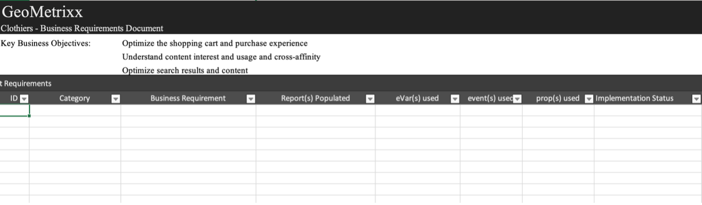

# 下载Adobe Analytics实施手册

开始之前， [下载playbook](assets/aa-implementation-playbook.xlsx).

## “业务要求”选项卡

**什么：** 业务要求文档（通常称为BRD）是重要的文档片段，关键利益相关方、业务用户和技术用户将希望对其进行协作。 在此，您可以记录所有所需的KPI、报表要求以及您希望在Adobe Analytics(AA)实施完成时查看的任何数据点。

**原因：** 这是后续文档（SDR、技术规格等）的跳转点 并且是AA协议结束状态的共同真相来源。 本文档在组织内跨团队组织各种思考，以形成一个指导方向，以便在构建或加强实施方面继续前进。

**操作方法：** 记录业务需求通常由AA的最终业务用户完成，但务必要从技术用户那里获得反馈，因为可能需要注意一些技术挑战，而某些数据点可能比其他数据点需要更多的努力，这是确定优先级的因素。

问您自己，“我们希望在网站上跟踪哪些内容”、“哪些数据点对我在报告使用中很重要”，最重要的是，“这些数据点将如何为决策提供信息”。 确保您的每项业务要求都与一个数据点相关，该数据点可用于为业务决策提供信息，这一点非常重要。 例如，您可能会忍不住想要跟踪您网站上的每次点击，但是，在一天结束时，您从该报表中了解哪些分析？

首先，在以下屏幕截图中填写C列（业务需求）。 这应该类似于“网站上完成了多少次内部搜索”或“在展示次数方面，哪个内部促销活动点最有效”。 填写此级别的详细信息后，您可以返回并填写B列（类别），并将要求分组为“搜索”或“内部促销”等类别，这些类别应与您的技术规格部分很好地对应。

您还将指示您是否认为使用eVar、事件、prop或组合可以实现要跟踪的内容。

最后，当您开始向网站添加内容时，实施状态列将用作状态检查。

## “变量映射”选项卡（标记文档/SDR）

**什么：** 标记文档（通常称为SDR）是对AA的技术用户和业务用户都有价值的重要文档。 它列出了报表包正在使用的每个变量以及变量设置、变量的实施方式及其在报表中的用途的所有相关详细信息。 与您的资产文档一样，这应该是一个管理得当、生动的Excel文档，由专人负责在引入标记增强功能或实施更改时使其保持为最新。

**原因：** 本文档将用于多种目的，但最重要的是：

* 对于您实施的新人员（新员工、希望更好地了解可用报表的业务所有者等） 本文档提供了所有已实施变量的最佳视图及其用途，以便个人在了解AA设置时可以自助服务。
* 对于AA产品所有者/技术用户，本文档将提醒您如何设置其他变量，以及哪些变量可在添加新维度时使用。

**操作方法：** 首先，在Excel文档中列出所有Adobe现成的变量（页面、产品、地域等），以及eVar、prop、事件和列表变量。 每个网站/报表包应具有一个选项卡。
对于这些维度，我添加了以下列：
* **名称：** 提供一个简单而短的名称，这个名称大多数人都能理解。 这应该足够直观，以便新用户能够选取该变量并了解要捕获的变量。
* **描述：** 有关变量的用途及其跟踪的数据的更多详细信息。 我保留了这个简短而简单的字段，并且使其与界面中使用的描述相匹配。 理想情况下，我不希望用户永远需要查阅标记文档。 因此，当在管理员后端设置新维度时，我会在此处添加相同的描述。 这样，用户就可以直接在工作区中点击信息图标，以了解维度是什么 — 无需提取Excel文档！

* **代码：** 来自后端的代码，用于设置值。 这可以是页面上数据层的字段，也可以声明这是通过Launch规则、处理规则等完成的。
* **分类报表：** 调用使用分类导入器或分类规则生成器完成的任何分类报表
* **解决方案范围：** 我发现在小列中列出所有属性（至少使用多个标准变量的属性）并为该属性上设置的每个维度添加复选标记非常有用。 这样，您就可以轻松筛选特定属性，并快速查看特定维度的设置位置。
* **配置：** 每个变量的管理员UI设置（例如，eVar — 过期、分配、推销等）

示例SDR的屏幕截图：

还建议使用此标记文档来跟踪任何自由变量和任何“垃圾”变量。 当维度不再有用时，开发人员通常需要一些时间来删除它。 即使在此之后，也可能会发生缓存，或者您可能会意识到，该维度也在其他位置设置。 清理维度不容易，而且通常需要耐心。 以下是一些将您的垃圾邮件隐藏在床下的提示，以便用户在跟踪垃圾邮件时不会感到困惑。

* 所有未使用的维度/事件均为“免费”或“正在删除”
   * 如果维度在过去90天内具有无用值，则它将“被删除”
   * 如果维度是免费的且至少在过去90天内是清晰的，则它是“免费”的
   * 在标记文档中的“名称”下按此形式标记这些标记，以便您可以轻松过滤这些标记。 我在标记文档（Excel数据过滤器）中未选中这些标记，以便用户看不到它们
   * 在界面中将这些eVar标记为数据名称，以便用户在搜索中不会找到它们(例如，“(v6)”)，并删除界面中的描述
* 这样，在需要新维度时，您就可以轻松地在“名称”列中筛选“free”，以找到要使用的干净维度
* 对于“正在删除”的维度和事件，我建议您使用工作区来跟踪这些维度和事件：
   * 仅创建对管理员可见的项目，其中包含3个表：eVar、prop和事件。 例如，我将“实例”用于特定eVar，并且对于prop，我会创建具有“prop5存在”的HIT区段。
   * 将日期设置为过去90天
   * 将上述作为3个表中的行以及发生次数使用
   * 一旦任何内容都转到“0”，我会在标记文档中将其标记为“免费”，然后将其从工作区项目中删除

这样，您的数据就始终是干净的，并且您对垃圾邮件有清晰的认识。

## “属性”选项卡

**什么：** 属性文档应列出您的所有数字属性 — 网站、移动设备应用程序、其他工具（聊天、反馈等），无论这些属性是否使用Adobe Analytics进行标记。 这应该作为跨业务和技术用户的集中、实时文档。

**原因：** 这将让您清楚地了解用户在所有数字资产中的历程，以及Adobe Analytics的功能和不涵盖的内容，以便您可以开始优先向任何缺少标记的资产添加标记。 通过以这种方式布局数字生态系统，您可以在标记策略中发现潜在的机会，以全面了解用户历程。 例如 — 您是否需要一个全局报表包才能跨多个域/网站进行跟踪？ 是否需要在域或应用程序之间切换访客ID以实现混合体验？ 是否需要更新内部URL过滤器以进行跨域跟踪？

**操作方法：** 确定文档的所有者以提供管理，并确定管理更新的单一责任来源。
在“属性”选项卡中列出以下内容：
* **属性名称：** 这可以是域、子域、应用程序名称等。 即使在同一域内，如果其某些部分是单独管理的（如由不同的团队或不同的技术管理），则应将这些部分分开。
* **链接(URL)** 属性（如果可用）
* **所有者和联系人：** 列出资产的主所有者或联系人
* **标记方法：** 我们中的许多人拥有不同的代码方法和实施（Launch、JS文件、AEP等）。 如果需要，您可以进一步划分此代码（例如，通过代码版本或标签管理系统），但这是为了跟踪您所有不同的代码方法和版本、需要更新代码的位置以及需要如何维护代码。 如果您使用的是LaunchAdobe，请列出Launch属性名称。

请记住包含所有数字属性，即使这些属性未使用Adobe Analytics进行标记。 这将帮助您了解数字环境以及用户如何与您的所有资产进行交互。

建议尽量保持本文档简单，不要在信息过多的情况下将其关闭，以便组织内不同部分仍易于理解。 Analytics团队通常比其他团队更了解数字环境，因此其他团队和主管通常会使用此文档来提供全面的概述。

>[!TIP]
>
>在Adobe Analytics中创建网站名称/属性维度。 在Adobe Analytics中使用专用维度(通常是eVar)来标识网站名称/应用程序名称，这将允许对网站进行分段、疑难解答、创建虚拟报表包等。 好处无穷无尽，尤其是当在一个（全局）报表包中组合使用多个网站时。 关键是确保开发团队始终在属性维度中设置此值，包括所有页面加载（s.t调用/trackState）和所有自定义事件（s.tl调用/trackAction）。 处理规则可能是帮助您正确且一致地设置这些值的宝贵工具。

[观看Doug Moore的此视频](https://experienceleague.adobe.com/docs/analytics-learn/tutorials/implementation/implementation-basics/creating-a-business-requirements-document.html){target=&quot;_blank&quot;}以了解有关填写实施手册的详细信息。

## 作者

本文档由以下人员共同编写：

Christel Guidon，NortonLifeLock Adobe Analytics Champion的Digital Analytics平台经理

Rachel Fenwick，Adobe高级顾问
