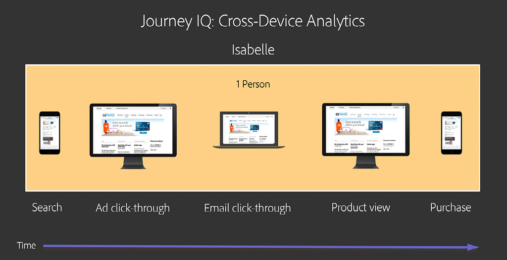

# 了解和使用[!DNL Journey IQ] — 跨设备分析

当用户与您的品牌进行交互时，他们会通过多种方式在多种设备上进行交互。 跨设备分析与[!DNL Adobe Experience Platform Identity Service]集成，以识别设备如何映射到人员。 然后，它会利用此智能创建用户行为的跨设备视图。 这样就能够对人员、而非设备进行分析。

## 跨设备分析概述

### 我不是我的设备

当用户与您的品牌进行交互时，他们会以多种方式在多个“表面”或“设备”上进行交互。 他们可能在PC或移动设备上使用Web浏览器，也可能使用移动应用程序。 在传统的数字分析中，每个表面都表示为一个独特的“访客”。 这意味着您的每个人类用户都表示为一个多个独特访客。

以下是一个示例。 假设Isabelle通过以下方式与您的品牌进行了交互：

*Isabelle有三个访*

使用传统分析，伊莎贝尔的历程分为三部分。 她被表示为三位独特访客，每位访客使用不同的设备执行孤立的任务。 我们需要对伊莎贝尔的互动进行统一的跨设备视图。 [!DNL Journey IQ: Cross-Device Analytics] 提供此视图。

*Isabelle是*

### 跨设备视图可提供更好的分析功能

以人为中心、跨设备查看伊莎贝尔的行为，对您的分析会产生显着影响。 例如，传统的基于访客的方法并不能让您全面了解营销渠道的有效性。 让我们再次看一看Isabelle的历程，重点介绍哪个渠道会因产品查看和购买获得点数。 为了简单起见，我们将使用[!UICONTROL 最近联系]归因，但是当您将Isabelle的行为划分为不同的访客时，使用任何归因模型都会出现同样的问题。 使用基于访客的传统世界观会产生非常不同甚至误导的结果：

*传统Analytics与跨设备分析渠道*

请注意，在跨设备视图中，电子邮件渠道会同时接收产品视图和购买的点数，这更准确地反映了Isabelle的真实世界体验。

请继续阅读，以了解：

* [!DNL Cross-Device Analytics]的工作原理
* [!DNL Cross-Device Analytics]的先决条件
* 解释跨设备数据
* 在Analysis Workspace中分析跨设备数据

## [!DNL Cross-Device Analytics]的工作原理

[!DNL Journey IQ: Cross-Device Analytics (CDA)] 与集成， [!DNL Adobe Experience Platform Identity Service]利用或来 [[!DNL Co-op Graph]](https://docs.adobe.com/content/help/zh-Hans/device-co-op/using/home.html) 识 [!DNL Private Graph] 别设备如何映射到人员。然后，它会利用此智能创建用户行为的跨设备视图。 CDA包含无与伦比的功能和工具，可帮助您的企业了解多设备使用情况以及这些设备与品牌交互时的客户体验。 它作为Analysis Workspace下的一个层，使用诸如[!UICONTROL Floust]、[!DNL Flow]、[!DNL Cohort]、[!DNL Segment IQ]和[!DNL Attribution IQ]之类的强大工具，对基于人员的受众分析和跨设备归因、分段和历程分析提供深入的分析。

### [!DNL Cross-Device Virtual Report Suite]

CDA通过一种特殊的跨设备[[!UICONTROL 虚拟报表包]](https://docs.adobe.com/content/help/zh-Hans/analytics/components/virtual-report-suites/vrs-about.html)来呈现。 这允许您在组织中引入跨设备分析时，继续使用原始的基于设备的报表包。 设置CDA VRS非常简单。

在VRS生成器的第一步中，选择已将Adobe配置为启用CDA的[!UICONTROL 报表包]:

*选择启用CDA的基础（源）报表包虚 [!UICONTROL 拟]*
![[!UICONTROL 报表] 包一](assets/cda-vrs-step-one.png)

然后，打开[!UICONTROL 报表时间处理]并启用[!UICONTROL 跨设备拼合]:

*启 [!UICONTROL 用报表时] 处理 [!UICONTROL 和跨设备]*
![[!UICONTROL 拼合虚拟报表] 包第二步](assets/cda-vrs-step-two.png)

完成VRS设置并保存。 CDA VRS将在Analysis Workspace中显示，其旁边有一个特殊图标，如下所示：

*在Analysis Workspace中选择CDA VRS虚拟报*
![[!UICONTROL 表包] 步骤三](assets/cda-vrs-step-three.png)

>[!TIP]
>
>您可以在启用了CDA的基础[!UICONTROL 报表包]上，根据需要创建任意数量的CDA [!UICONTROL 虚拟报表包]。

### 重写历史

有时，您的用户需要一段时间才能登录，[!DNL Co-op Graph]或[!DNL Private Graph]需要一段时间才能识别他们并将他们的设备映射到一起。 CDA利用30天的回顾窗口，允许其将之前未识别的访客重新声明为过去30天的人员。

这有什么用？ 回顾Isabelle的用户历程：

![[!DNL Cross-Device Analytics] 历程](assets/cda-isabelle-journey-cross-device-analytics.png)

Isabelle可能直到购买前才登录，而[!DNL Co-op Graph]或[!DNL Private Graph]直到购买后的某个时间才将Isabelle的设备映射到一起。 但CDA的30天回顾功能允许CDA在个人层面重述Isabelle的过去行为，为您提供您所需的跨设备历程视图。

>[!NOTE]
>
>由于历史记录可以重述，这意味着在启用CDA的[!UICONTROL 虚拟报表包]中，数据可能会随时间发生更改。 当您通过基于CDA的分析传递洞察时，请牢记这一点。

## [!UICONTROL 跨设备分析]的先决条件

[[!DNL Analytics Ultimate]](https://helpx.adobe.com/legal/product-descriptions/adobe-analytics.html)中包含CDA。 从2019年9月开始，符合下列先决条件的[!DNL Analytics Ultimate]客户有资格使用CDA。 CDA的先决条件如下：

* 您的公司必须是[!DNL Adobe Experience Platform Identity Service] [[!DNL Co-op Graph]](https://docs.adobe.com/content/help/en/device-co-op/using/home.html)的成员，或使用[!DNL Adobe Experience Platform Identity Service Private Graph]。
* 您必须实施[!DNL Co-op Graph]或[!DNL Private Graph]所需的所有功能，包括[Experience CloudID(ECID)](https://docs.adobe.com/content/help/zh-Hans/id-service/using/home.html)和ID与图形同步。 请注意，除技术要求外，[!DNL Co-op Graph]还有其他法律和合同要求。
* 当前无法将两个IMS组织与单个[!DNL Private Graph]一起使用，因此您必须在单个IMS组织上实现标准化。 在某些情况下，具有多个IMS组织的客户可能会将[!DNL Co-op Graph]与CDA结合使用。
* [!DNL Co-op graph]和[!DNL Private Graph]以及CDA的某些组件托管在[!DNL Microsoft Azure]中。 这意味着[!DNL Analytics]数据在Adobe的数据处理中心和Adobe在[!DNL Microsoft Azure]中的存在之间来回复制。 某些[!DNL Analytics]数据将存储在[!DNL Azure]中。 贵公司必须同意这项安排。
* CDA需要“跨设备” [!UICONTROL 报表包]。 即，您用于CDA的[!UICONTROL 报表包]必须包含来自多种不同设备类型或“界面”（如桌面Web、移动Web和移动设备应用程序）的数据。 自2019年9月起，此[!UICONTROL 报表包]的服务器调用卷必须为100MM/天或更小。 （未来几个月内，服务器调用数量限制将会增加。）
* 自2019年9月起，[!DNL Co-op Graph]和[!DNL Private Graph]仅在北美地区可用。 在EMEA和APAC的图形存在计划将在未来时间宣布。 如果您位于这些区域，我们建议您立即开始查看这些先决条件，以便在图形可用时随时可用。

## 解释跨设备数据

### 非访客人员

在CDA [!UICONTROL 虚拟报表包]中，您将看到一些更改。 例如， [!UICONTROL 独特访客]量度将被两个新量度替换：[!UICONTROL 人员]和[!UICONTROL 独特设备]。 这些新量度可让您更好地分析受众规模。

*人员和独特设*
![备CDA人 [!UICONTROL 员量度]](assets/cda-people-metric.png)

在[[!UICONTROL 区段生成器]](https://docs.adobe.com/content/help/zh-Hans/analytics/components/segmentation/segmentation-workflow/seg-build.html)中，[!UICONTROL Visitor]区段容器已被替换为[!UICONTROL Person]区段容器。 使用CDA VRS，您可以创建跨设备区段，例如：

* 使用多个设备的用户
* 在移动设备上开始旅程，然后在桌面设备上购买的人
* 用户使用多个设备完成任务的访问

*人员级别的*
![[!DNL Segment Builder]  区段PersonContainer](assets/cda-segment-builder-person-container.png)

### Dimension持久性

在CDA VRS中，如[!DNL eVars]之类的维度现在会自动跨设备保留。 例如，[!DNL eVar]配置为：

* 分配：最近（最后）
* 过期时间：购买

现在，将自动从一台设备保留到另一台设备，直到触发购买事件为止。

## 在Analysis Workspace中分析跨设备数据

### 基于人员的受众分析

您是否曾想过有多少人与您的品牌互动？ 您是否希望了解他们使用的设备数量和类型？ 使用情况如何重叠？ 使用CDA VRS，可以创建跨设备[维恩图](https://docs.adobe.com/content/help/zh-Hans/analytics/analyze/analysis-workspace/visualizations/venn.html)和每人设备[直方图](https://docs.adobe.com/content/help/zh-Hans/analytics/analyze/analysis-workspace/visualizations/histogram.html)。

*基于人员的受众分*

### 跨设备[!DNL Flow]

借助CDA和Analysis Workspace，您可以在[[!DNL Flow visualization]](https://docs.adobe.com/content/help/zh-Hans/analytics/analyze/analysis-workspace/visualizations/flow/flow.html)中显示用户在一段时间内如何从一个设备移动到另一个设备。 你可以看到他们在旅程中的下落，以及他们继续的位置。

*[!DNL Flow]和CDA*
![[!DNL Flow Visualization]](assets/cda-flow-viz.png)

### 跨设备[!DNL Fallout]

您可能会使用几个[[!DNL Fallout visualizations]](https://docs.adobe.com/content/help/zh-Hans/analytics/analyze/analysis-workspace/visualizations/fallout/fallout-flow.html)来分析用户在成功前通过一系列给定步骤获得成功的效果。 您是否知道在使用传统的基于设备的分析时，您对这些[!DNL Fallout visualizations]的看法会受到限制？ 要成功“途经”，下一步必须在与上一步相同的浏览器或应用程序中进行。 在基于设备的分析中，对于在其他设备上成功完成下一步的用户，您是无视的。

别担心，CDA已经掩护你了。 CDA会创建跨设备视图，该视图会使[!DNL Fallout visualizations]变得更有用。 毕竟，真正重要的是，人是否最终在某个地方成功完成了任务。

*[!DNL Fallout]和CDA*
![[!DNL Fallout Visualization]](assets/cda-fallout-viz.png)

### [!DNL Cross-Device Attribution IQ]

由于CDA在Analysis Workspace下创建了一层跨设备数据，因此您的所有分析都将从跨设备的角度来考虑。 一个有力的示例是[[!DNL Attribution IQ]](https://docs.adobe.com/content/help/zh-Hans/analytics/analyze/analysis-workspace/panels/attribution/attribution.html)。 [!DNL Attribution IQ] 在Analysis Workspace中，您可以并排比较多个归因模型。现在，您可以将此功能与CDA结合使用，以比较不同设备对成功的贡献。

例如，假设您想要了解移动电话是交互中第一个最终导致成功的设备的频率。 此值表示移动电话的“获取率”。 CDA + [!DNL Attribution IQ]允许您进行以下分析：

*[!DNL Attribution IQ]和CDA*
![[!DNL Attribution IQ]](assets/cda-attribution-iq.png)

有关更多信息，请参阅[[!DNL Cross-Device Analytics] 帮助文档](https://docs.adobe.com/content/help/zh-Hans/analytics/components/cda/cda-home.html)。
