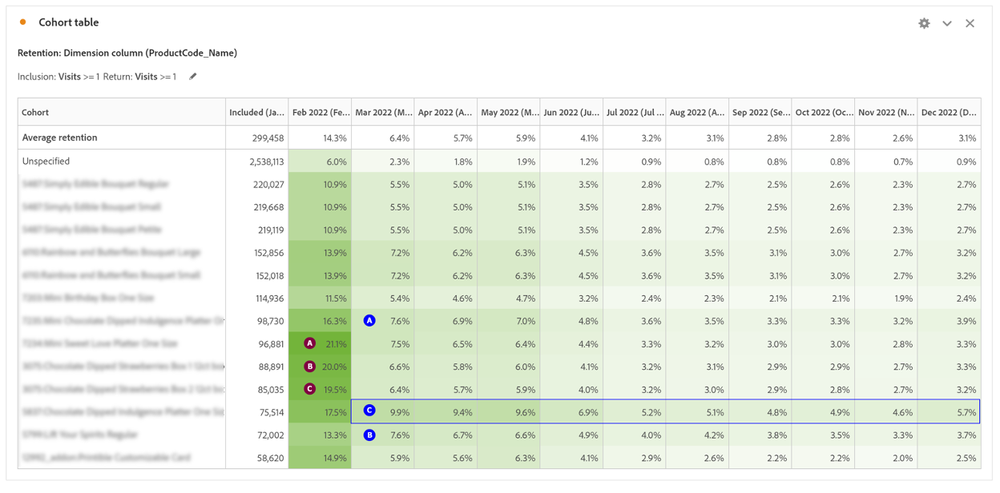

# 使用同类群组分析了解客户行为

要改善客户体验和收入，企业必须了解客户行为。 同类群组分析有助于理解参与度和维系率，从而导致采取诸如改进客户创建和为大量月份创建促销活动等操作。

分析数字性能对于了解客户如何与企业进行交互以及可以采取哪些措施来改善其体验至关重要。 在这篇博客文章中，我们将探讨如何使用同类群组分析更好地了解客户行为。

## 第一部分：首次访问与回访之间的数字性能比较

### 设置舞台

一位客户希望了解过去2年的数字化绩效，并正在考虑开发忠诚度计划以提升数字化绩效。 首先，我们可以查看当前新用户和重复用户之间的网站组合，了解这两组访客的行为方式。

当前数字性能

1. 2022年，62%的订单来自首次访问，而38%的订单来自回访（受Cookie、多设备限制）。
1. 首次访问转化率略高于回访率，二者的转化率为11.6%，而回访率为11.4%。
1. 与2021年相比，这两个领域的转化率都有所下降。

## 第2部分：同类群组分析 — 访问可食用安排全局生产

要了解数字渠道的吸引力和吸引回头客的机会，下一个要回答的问题是：2022年每月回访网站的访客数量是多少？

### 同类群组分析简介

同类群组分析是一种有用的工具，可帮助您了解同类群组在一段时间内如何与品牌互动。 首先，我们确定了要回答的问题：

1. 在给定的年份中，平均保留期（按月）是多少？
1. 给定年份中每月回访网站的访客量是多少？
1. 登录对维系有何影响？
1. 是否有特定产品提高了保留率？

如何设置同类群组表

1. 将日期范围设置为2022年1月至12月
1. **包含标准：** 访问次数
1. **回访标准：** 访问次数
1. **粒度：** 月
1. **设置：** 滚动计算\*\*允许您根据前一列而不是所包含的列计算维系率。 因此，这意味着用户将包含在每个月\*\*中
1. **区段：** 您可以选择特定区段以进一步驱动此分析
   1. 特定登陆页面
   1. 设备类型
   1. 营销渠道
   1. 等等

### 解释结果

**2022年：**

1) 保留率最高的月份+1个月包括1月、4月和11月
1) 数量最多的月份包括2月和5月
1) 每月约有1,000名访客返回网站

**2021年：**

1) 保留率最高的月份+1个月包括4月、1月和3月
1) 数量最多的月份包括2月和5月

**操作项：**

根据约1,000位访客创建一个区段，并进一步了解他们：

- 他们在哪里？
- 他们全年购买哪些产品？
- 他们从哪家商店买东西？

关键月份突出了根据流量推动保留的机会：

- 是否有特定的策略可能会在2月和5月带来额外的吸引力以利用流量？

对订单进行重复分析以了解重复购买者

- 同一月份的最高+1个月保留率吗？
- 订购的最高访问月份是否相同？

## 第三部分：将两个量度添加到包含标准

### 了解登录的影响

由于此客户希望了解忠诚度计划的价值，因此分析的下一步包括在登录成功事件中添加作为包含量度到同类群组。

注意事项：同类群组分析不能用于计算量度（如转化率）或非整数量度（如收入）。 只有可以在区段中使用的量度才能在同类群组分析中使用，并且它们一次只能递增 1。

网站是否更有可能保留正在登录的用户？

如果我们能够让更多用户登录，会产生什么影响？ 那是更贴切的体验吗？

### 设置同类群组表

1. **设置日期范围：** 2022年1月至12月
1. **包含标准：** 访问量+登录成功事件
1. **回访标准：** 访问次数
1. **粒度：** 月
1. **设置：** 滚动计算\*\*允许您根据前一列而不是所包含的列计算维系率。 因此，这意味着用户将包含在每个月\*\*中

### 解释结果

**2022年：**

1) 维系率最高的月份+1个月包括1月、4月和11月（与第一个同类群组表相同的月份）
1) 数量最多的月份包括2月、5月和12月
1) 每月大约有2500名访客回访，他们的回访次数\*\*超过两次\*\*

**操作项：**

调查在结帐期间让用户创建帐户的网站用户体验

## 第4部分：自定义Dimension同类群组

自定义维度同类群组：创建基于所选维度的同类群组，而不是基于时间的同类群组（默认）。许多客户想要按时间以外的其他方式分析他们的同类群组，现在，通过新的自定义维度同类群组功能，可以灵活地根据他们所选的维度构建同类群组。在 Adobe Analytics 中使用营销渠道、促销活动、产品、页面、区域或任何其他维度，可显示维系率根据这些维度值的不同有何变化。该

自定义Dimension同类群组区段定义仅将维度项目作为包含时段的一部分应用，而不是作为返回定义的一部分应用。

选择自定义维度同类群组选项后，您可以将所需的任何维度拖放到拖放区域中。这允许您比较同一时段内的类似维度项目。例如，您可以并排比较城市的绩效

侧、产品、营销活动等。 它将返回您排名前14的维度项目。 但是，您可以使用过滤器（通过悬停在拖动的维度右侧即可访问）仅显示所需的维度项目。自定义维度同类群组不能与延时表功能一起使用。

### 哪些产品会提升网站吸引力？

自定义Dimension同类群组表重点介绍了维系率高于平均水平的产品。  此表可帮助确定您的热门产品，以推动以最受关注的产品为特色的内部和外部营销活动。

**2月：** 3种产品的保留率更高

1) Product1
1) Product2
1) Product3

**3月：**

1) Product1
1) Product2
1) Product3  — 与平均保留率相比，通常性能要优于平均保留率。

## 结论

同类群组分析和自定义Dimension同类群组是用于了解客户行为和提高数字性能的强大工具。 通过分析保留率、登录率以及特定产品的影响，企业可以做出数据驱动型决策，以改善客户体验并推动增长。

## 作者

本文作者：

**珍妮弗·亚肯达**,Director万豪酒店

Adobe Analytics 负责人