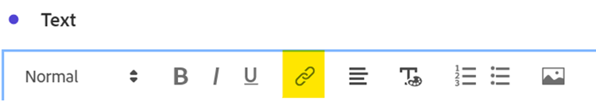

# 不只是词语 — 在Analysis Workspace中使用文本可视化和描述

作为Adobe Analytics Analysis Workspace用户，您通常会关注数据和数据可视化图表，这很自然 — 任何人都可以键入摘要，对吗？ 但是，忽略Analysis Workspace中的功能（如文本可视化图表或可视化图表描述），可能意味着缺少将分析与有价值的文本、图像、gif和链接相结合的宝贵机会。 通过提供参考和更多上下文信息以告知用户您的数据含义，可以提高数据的效率和影响力。

首先，确保您知道可以在何处找到这些功能：

- 要添加或修改可视化的描述，只需右键单击元素的顶部区域并选择“编辑描述”链接：

   

- 要添加单独的“文本”面板，请单击左侧导航栏的“可视化”菜单：

   

虽然本指南显示了使用这两种方法之一的示例，但您可以在描述和文本可视化图表中添加类似的内容。 您还可以调整字体间距、对齐方式、颜色，以及生成项目符号或编号列表：

让我们开始吧！. 要添加到任何Analysis Workspace项目的一个非常有用的上下文是超链接 — 这可以包括链接到报表中详细页面的URL、指向其他Analysis Workspace项目的链接、外部报表上下文页面，或查看报表时可能会有所帮助的任何其他内容。 可通过选择文本的任意部分并选择“链接”图标来访问此功能：

因此，查看Analysis Workspace项目的任何人只需单击一次，即可访问他们在线或组织内部网络中可访问的任何页面：

现在，如果您希望将内容直接放入报表中，则可以使用图像链接将内容放在数据旁边：

您可以向报表添加一个可在任何公共URL上访问的图像，只要该URL位于 *https* 格式，格式为.png、.jpeg、.jpg或.gif — 虽然这听起来有些限制，但任何用于共享图像或GIF（如imgur或GIPHY）的在线工具都可以使用共享链接来快速上传可访问工作区的文件。

结果呢？ 您可以在项目中直接显示您的数据正在引用的网页：

您还可以在项目中使用GIF来包含移动图像，如站点演练、您网站的理想路径或应用程序上的任务，或者只是向您的团队展示如何 ***惊心动魄*** 您的报表现已变为：

## 作者

本文作者：

**丹·卡明斯**, McDonald&#39;s Corporation高级产品工程分析经理

Adobe Analytics 负责人

