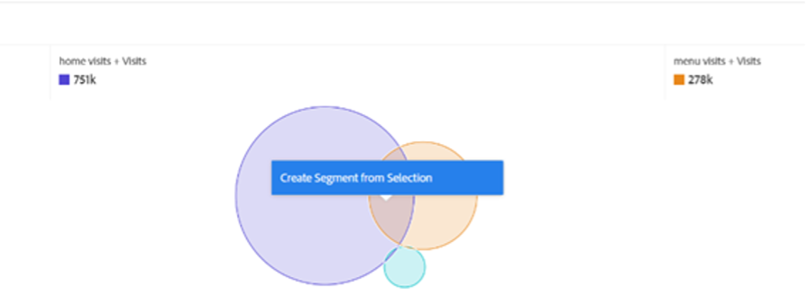

# 现在，只需等待一个区段……使用区段在Analysis Workspace中发现新的洞察

无论您是新的Adobe Analytics用户还是经验丰富的专业人士，您都会在Analysis Workspace项目中充分利用区段。 作为 [Adobe Experience League](https://experienceleague.adobe.com/docs/analytics/components/segmentation/seg-overview.html?lang=en) 描述，“利用区段，可根据特征或网站交互来识别访客子集。” 虽然此功能的基本结果意味着隔离网站的用户、访问或点击组，但头脑敏锐的分析师（如您自己）可以使用此工具发挥创意，并找到新方法来深入了解您的网站活动。 可能的选项列表很多，因此请随时尝试创建您自己的选项，并将其与组织中的其他人或在诸如 [Adobe Analytics社区](https://experienceleaguecommunities.adobe.com/t5/adobe-analytics/ct-p/adobe-analytics-community) Experience League或 [#MeasureSlack](https://www.measure.chat/) 社区。

如果您需要快速刷新有关如何创建区段的信息，请查看有关使用的Experience League文档 [区段生成器](https://experienceleague.adobe.com/docs/analytics/components/segmentation/segmentation-workflow/seg-build.html?lang=en) 在Analysis Workspace。

## 比较和对比区段

在Analysis Workspace中，您可以使用“[区段比较](https://experienceleague.adobe.com/docs/analytics/analyze/analysis-workspace/panels/segment-comparison/segment-comparison.html?lang=zh-Hans)&quot; 区段比较可在左侧导航栏的“面板”部分找到：

但是，有时您不需要完整的比较面板即可向最终用户提供关键分析。 值得庆幸的是，某些功能也可以在标准面板中进行比较。

的 [维恩图可视化图表](https://experienceleague.adobe.com/docs/analytics/analyze/analysis-workspace/visualizations/venn.html?lang=zh-Hans) 有助于创建快速比较，从而允许您将鼠标悬停在鼠标上并查看重叠的会话、订单、用户等。 在2-3个自定义区段之间。 您还可以通过右键单击任意重叠部分来快速生成区段：

有时，重要信息不在重叠的数据中，而是不重叠的数据中。 查看此内容的快捷方法是创建一个区段的副本，并将其设为“Exclude”区段：

通过将“exclude”区段与比较中的其他区段堆叠，您现在可以快速计算点击菜单页面的访问次数，而无需同时查看同一会话中的主页：

## 堆栈攻击

同样，您也可以通过将任意区段堆叠在一起来创建维恩图的交叉数据。 堆叠的区段或单个维度的数量没有限制。 例如，如果我想快速了解上个月“每周日”我的网站在手机上访问了哪些内容，尤其是三星Galaxy A52，它的确看到了我的菜单和营养页面，但没有看到我的主页，那么我可以像这样快速构建它：

但更妙的是，一旦我找到我的用户或访问群的完美子集，我就可以选择所有这些值，右键单击并立即创建一个区段：

这在一个区段中是很大的力量。

## 多个区段的数字区段

在生成区段时，许多用户通常会查看名义值、序数值或间隔值，例如已访问的页面、用户年龄范围或用户过去的访问次数。 但是，在创建区段时，您也可以通过分段这些值（无论是标准维度、标准量度还是组织的自定义变量和量度）来使用比率数据。

例如，“页面逗留时间”或“每次访问逗留时间”具有可用的预建时段：

但是，这些访问次数可能并不总是符合您组织的需求 — 可能网站的大多数访问时间都少于10分钟。 您可以使用粒度测量来创建大小不同的存储段。 下面创建了一个视图，用于查看持续1分钟、1秒和1分钟、30秒的访问：

创建后，我现在可以开始按我自定义的不同分段统计时间组来查看我的访问、订购和其他事件：

您甚至可以开始检查关键绩效指标(KPI)的变化情况，它是用户花费的时间、用户在一次访问中点击的页面数量、他们过去访问过的次数或任何其他数值的一个因素，这基本上允许您将量度视为其他量度的一个因素：

使用区段寻找新洞察的可能性无穷！ 这只是一个起点。 自己尝试一些，并告知社区您发现的内容： [Adobe Analytics社区](https://experienceleaguecommunities.adobe.com/t5/adobe-analytics/ct-p/adobe-analytics-community) Experience League或 [#MeasureSlack](https://www.measure.chat/) 社区。

快乐地分段！

## 作者

本文作者：

**丹·卡明斯**, McDonald&#39;s Corporation高级产品工程分析经理

Adobe Analytics 负责人

