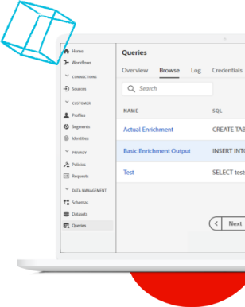

# Experience League LIVE

## 加入我们，观看下一场直播！

Experience League LIVE 是 Experience League 团队制作的直播节目。利用这个机会，您可以与 Adobe 产品专家联系并学习可用于 Adobe Experience Cloud 应用程序的可操作性提示、技巧和策略。

## Experience League LIVE 活动即将播出！

<table>
<tr>
  <td>
      
     

          <strong>客户历程</strong>
     

     

          <em>2021 年 9 月</em>
     

    

    <em>向产品专家学习如何构建实时适应客户的体验</em>
    

  </td>
  <td>
      
     

          <strong>Content and Commerce</strong>
     

          <em>2021 年 10 月</em>
     

     

    

    <em>了解如何大规模创建和管理内容并构建个性化的商务体验</em>
    

  </td>
  <td>
      
     

          <strong>Experience Platform</strong>
     

     

          <em>2021 年 12 月</em>
     
    
    

    <em>向产品专家学习如何构建实时适应客户的体验</em>
    

  </td>
</tr>
</table>

## 精彩回放

错过了某场 Experience League LIVE 吗？不过没关系，请观看我们的精彩回放！

<table>
<tr>

<td>
    
     

          <strong>嘉宾</strong>：<i>Eric Matisoff 和 Dasha Fitzpatrick</i>
     

     

          <em>2021 年 7 月 29 日</em>
     
    
    

    <em></em>
    

  </td>
</tr>
</table>

>[!TIP]
>
>如需了解更多学习方法，请查看我们的免费[课程](https://experienceleague.adobe.com/#dashboard/learning)和各个[教程](https://experienceleague.adobe.com/docs/home-tutorials.html?lang=zh-Hans)。
