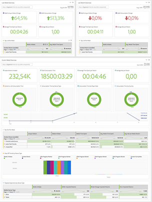

# 从Google Analytics过渡到Adobe Analytics的全面指南

## 1.导言

在任何工具之间进行转换的最大挑战之一是了解如何找到等效的功能，以及了解如何高效使用它。 此讨论是帮助用户更轻松地迁移到Adobe Analytics(作为新用户或来自Google Analytics的用户)的较大指南的一部分。 与GA进行深入比较；作为大多数用户都熟悉的最可能的比较工具；可帮助用户将现有知识与新工具集关联。 尽管没有替代实践的方法；这将有助于你开始学习，并希望减少你在这段时间可能遇到的挫折（或者，在你开始摆弄事情后，再补充一下）。

我们还应该快速比较术语：

| **描述** | **Adobe Analytics** | **Google Analytics** |
|--------------------------------------------------------------------------------------------------------------------------------|---------------------|----------------------|
| 已查看表示某个页面（或应用程序上的屏幕）的事件量度 | 页面查看 | 页面查看 |
| 一个量度，用于表示网站或应用程序上在同一时间范围内进行的一组交互 | 访问 | 会话 |
| 一种量度，用于定义已识别的设备（基于多个标准，包括Cookie和其他行为模式以拼合用户信息） | 独特访客 | 用户 |

## 2.界面

当人们比较Adobe Analytics和Google Analytics时，我最常看到的一件事是，Adobe有很多事情在发生 — 这对人们来说是令人望而生畏的。 这是真的，但也是真的；信不信由；是优势，而不是劣势。 Adobe在数据可视化图表中提供了多种工具和灵活性，使您能够更加自由地构建所需内容。

让我们从查看“站点内”报表开始。

### 2.1.现场报告

#### 2.1.1.主屏幕

Adobe Analytics和Google Analytics都提供了一种方法来自定义用户在登录时看到的第一个视图。

##### 2.1.1.1.工作区/自定义集主屏幕(Adobe Analytics)

Adobe Analytics不假定在登录时为所有用户创建一个预构建的报表。 默认主页会将用户带到工作区登录屏幕，该屏幕将向每位用户显示他们创建或与其共享的所有工作区报表。 此外，如果每位用户选择，还可以将其中任何报表设置为其主屏幕。

下面将详细介绍本指南后面有关工作区的详细信息。 请参阅2.1.2.1节

>[!TIP]
>
>创建/共享您的组织的一些标准报表，以便他们能够从一个起点开始查看信息，而无需专心构建自己的报表。

##### 2.1.1.2.主屏幕分析(Google Analytics)

* Google Analytics主屏幕中有一些预先构建的可视化图表。  这些内容涵盖如下内容：
* 过去7天内的用户数、会话数、跳出率和会话持续时间
* 过去30天中按时间划分的用户
* 当前用户和热门活动页面
* 过去7天内的流量渠道、来源/媒介和转接链接
* 过去7天各国会议
* 最近7天的热门页面
* 最近30天的活动用户趋势
* 其它

在GA4中，用户有更多选项可以自定义报表并将其添加到主屏幕。

这可能是你来Adobe时最想念的一件事；他们没有为您预建此类主屏幕，但您可以轻松地设置自定义工作区以复制上述功能中您需要的内容，如果您选择，可将其设置为登陆屏幕。 有关此内容的更多信息(或参阅第2.1.2.1节Adobe工作区)。

#### 2.1.2.现场Report Builder

除了分析工具提供的简单报表之外，每个工具还提供了更强大的工具，可用于构建您自己的自定义报表。

##### 2.1.2.1. Adobe Analytics工作区

这是Adobe Analytics的强大功能，自2017年推出以来，它已成为Analytics分析的首选平台，也是“报表”部分即将停用的主要原因。

利用此工具，可几乎自由地构建报表。

报表可以划分为多个面板，这些面板可以包含任意数量的可视化图表。 面板可以设置为常用信息，如日期范围和常用区段过滤器。

可以调整面板及其中的可视化大小并拖动其周围以并排显示项目或堆叠项目。 因此，如果您想要并排比较两个不同的数据包，可以创建一个面板，将中间的50/50分开，并排显示两个站点，以便轻松比较。

用户可以使用多种可视化图表：

* 自由格式表
* 同类群组表
* 流失
* 流量
* 图形
   * 面积图（堆叠和未堆叠）
   * 折线图
   * 散点图
   * 条形图（堆叠和未堆叠）
   * 项目符号
   * 圆环图
   * 直方图
   * 水平条形图（堆叠和未堆叠）
* 地图
* 摘要块
   * 概要变化
   * 摘要文本
   * 文本（用于输入附加信息以提供上下文的自由文本字段）
* 维恩图

每个面板和可视化图表都可以带有标题，并且会对其应用描述，以帮助提供信息所显示内容的上下文。
在Adobe中，区段（本质上是数据过滤器）会以追溯方式应用，并且这些区段可以提取到自由格式表的列中，以并排比较数据。 例如，如果用户希望比较其网站上的两个不同类别的流量；他们可以为“A类”创建一个区段，为“B类”创建另一个区段。

自由格式表允许根据需要有多列和分段，以便按您所需的方式使数据可视化。

从上面看，不想看到按日期划分的内容吗？ 只需将其他维度或区段拖放到此处，即可以其他方式查看数据……就像可能将区段用于设备类型一样，然后为移动设备/平板电脑用户添加按操作系统划分的内容：

工作区可让您发挥创意，而不仅限于“标准”划分。 您可以构建需要深入分析所需运行的比较的可视化图表。

>[!TIP]
>
>不要怕玩和探索，这里有很多方法可以在盒子外思考，看看你能做什么！ 但同时，请确保您尝试验证所构建的内容是否真实反映了您的想法。 体验此处会有所帮助！

您甚至可以创建只存在于报表内的即时计算量度或区段(防止区段和计算存储库洪泛，同时还确保您能够创建特定报表所需的重点项目，而不会将您的组织与在其他环境中不太可用的项目混淆。

此讨论仅是对此工具的介绍，有其他更全面的指南可帮助您入门，但在您开始讨论时，您将能够制作全面的报告，例如：

还应当注意的是，工作区不会自动保存，因此在不将报表存储库塞满的情况下，可以更轻松地执行一次性临时报表。

工作区的另一个强大功能是能够以下拉菜单的形式将交互式修饰符应用到报表。 虽然这些下拉列表不适用于报表的导出CSV或PDF文件，但在实时报表中，您可以更新面板中的所有可视化图表，以在不同的条件下显示同一报表。 可以使用多个下拉列表，只要选项不是互斥的，选定的项目就会堆叠，以便提供清晰的信息。

>[!IMPORTANT]
>
>要了解有关使用下拉列表和自由格式划分的更多信息，请参阅 <https://experienceleaguecommunities.adobe.com/t5/adobe-analytics-discussions/the-power-of-dropdown-filters-and-dimension-breakdowns-in-adobe/td-p/434680>

##### 2.1.2.2.Google Analytics:功能板、自定义报表和保存的报表

Google有一些用于在界面中创建报表的工具，但它们仍遵循报表部分的相同显示和限制。

对于读这篇文章时熟悉Google Analytics的人，您可能会说，“等一下，Google Data Studio怎么样，这是不是更像Adobe的工作区？” 并且您是正确的，但是由于Data Studio在技术上不是Analytics工具的一部分，并且允许连接不同的数据源，因此该工具稍后会在此讨论的“扩展报表访问”部分（特别是第2.2.3节）中介绍

Google功能板和自定义报表允许您将多个可视化图表一起提取到一个报表中，但与工作区不同，您仍会被锁定在简单的关联中，以及哪些数据可以放入哪些列中。

在自定义报表中，最大的挑战之一是当您创建过滤器时，它会应用于报表的所有选项卡……无法在同一报表中比较两个不同的过滤器。

为了进行表面比较，它会完成任务。 这些功能板都类似于Adobe原有功能板、自定义报表和书签。 为支持您的需求而提供的基本工具，这些工具位于报表包中。

#### 2.1.3.报告

Google和Adobe都有一些可导航的报表，这些报表是按构建的表格以及基于维度的基本时间轴图。

##### 2.1.3.1.Adobe Analytics报告

Adobe Analytics还有一个“报表”部分，不过总的来说，该部分主要是为了支持Analysis Workspace而逐步取消(实际上，自工作区起，已宣布此界面的生命周期终止 [第2.1.2.1节] 是一款功能强大得多的工具)，在其中可以更轻松地构建和修改大多数表。 Adobe的章节要详细得多，这可能令人望而却步：

由于上述大部分内容可通过工作区访问，因此我将简要概述这些部分以及它们与Google Analytics的关系，并突出显示此处仍相关的报表。

网站量度是您期望的，它涵盖标准量度（页面查看次数、独特访客数、访问次数，以及您设置的自定义事件）。 这类似于行为报表GA，但也包含您在受众中会找到的一些内容(因为Adobe不会对量度类型进行拆分)。

在此，您还会找到“机器人”报表，来自机器人程序的流量将从所有标准报表中排除，但是，有两个报表可让您对正在发生的情况以及哪些机器人程序将访问您的网站进行一些分析。 如果您设置自定义机器人规则来排除经常访问您网站的已知垃圾邮件制造者机器人，则这种方法尤其有用。 在主报表被淹没但流量不被淹没的情况下，您可以深入了解这些机器人正在执行的操作。 机器人报表当前无法通过工作区使用（但即将推出的新报表功能也将允许用户在此处获取此信息）。

网站内容是Adobe标准维度的分组：页面名称、网站区域（渠道）、层级（一种在您的网站中创建组织的自定义向下钻取报表的方式）、服务器（如果您的网站上有多个子域，或将多个网站标记到一个跟踪包中，则此功能将特别有用）等。 所有这些功能在工作区中均可用。

移动设备是特定于移动设备的数据的分组，例如设备、设备类型等。 所有这些功能在工作区中均可用。

路径是“在工作区中不太可用”项目中的另一种路径……虽然工作区具有流量图，但您只能在单个页面/值中看到输入和输出流量……而路径允许您查看网站中使用的最常见路径。 默认情况下，页面是为您设置的第一个路径报表，但您可以为自定义prop启用此功能(例如，如果要跟踪“页面类型”值，则可以查看页面类型中的路径。 我个人喜欢的另一个关于路径的内容是信息的呈现方式简单……工作区中的流程图（取决于您尝试查看的内容）可能会变得势不可挡。 我建议您同时尝试……根据您尝试实现的目标，每个用户都有一个用法和值。 应该注意的是，任何维度都可以在流中使用，而路径分析必须在“管理员”面板的Prop上设置。

流量源、促销活动和营销渠道报表都与Google中的客户获取报表类似。 流量源重点关注实际反向链接，促销活动重点关注您的促销活动代码，而营销渠道也重点关注促销活动代码，但同时也应用由您决定的关于如何处理信息的额外逻辑。 我发现Adobe为如何制定规则提供了更多的自由Google为你做了很多事情所以这将是思维上的一个转变。 还应当注意，默认情况下，Google对促销活动代码的归因为6个月，而Adobe的归因默认设置为1周。 您可以在管理员设置中更改此设置，但在工作区中，您实际上可以基于任何维度应用自定义归因，从而更加“即时”灵活。

访客维系和访客配置文件报表与Google Analytics中的受众报表类似。 维系更关注回访频度，而访客资料更关注用户的地理位置和技术。

自定义转化和自定义流量都是自定义维度报表，转化是您的eVar（在这里，您可以为值设置自定义到期 — 即点击、访问、月、年等……该值将保留给该用户指定的时间，除非被覆盖）。 流量变量是您的prop，但您也可以为路径报表设置这些变量，或设置为列表项（根据您选择的分隔符将多个值分开）。

媒体适用于您在其中设置了特殊媒体跟踪的视频或音频文件等内容。

“自定义报表”是一个部分，用户可以在其中自定义他们在报表界面中创建的列和划分，并将其另存为自定义报表。 但是，如上所述，由于工作区允许进行更强大的划分和关联，因此应该只提供任何自定义内容。 在工作区存在之前，这是一个不错的解决方案。

“书签”部分类似于自定义报表，在自定义报表界面中可以为常用报表添加书签，以便更轻松地找到这些报表。

功能板是一款旧版产品，它允许用户将数据的缩图报表合并到一个可视化中。 但是，工作区（第2.1.2.1节）中的功能更易于使用，因此它仅作为旧版报表的访问点存在，应在此功能停用之前重新构建旧版报表。

“目标”是一个特殊的报表区域，它允许用户在特定时间范围内根据目标创建报表，以便团队可以监控营销活动等项目，并查看他们是否在跟踪中以达到其流量目标。

此处允许对多个量度列和维度划分使用所有报表。 但可视化图表的简单性以及哪些元素可能相关的一些逻辑有时可能令人沮丧。

##### 2.1.3.2.Google Analytics报表

Google Analytics会将这些报表拆分为以下部分：实时、受众、客户获取、行为和对话（GA3中）以及生命周期(包含子部分：客户获取、参与度、盈利、维系率)和用户(包含以下子部分：人口统计和技术)。

您可以对这些可视化进行一些小的调整、添加次要维度划分、更改可视化、创建数据过滤器等。 您可以将自定义项另存为“保存的报表”。

这些功能可让您快速、轻松地分析数据。 但是，您无法将用户等内容与同一表格中某个页面的页面查看次数进行比较，也无法添加多个额外维度来查看其他数据。

这些数据对于快速分析数据很有用，但如果您真的需要深入挖掘，它们会受到限制。

### 2.2.扩展报表访问

除了“站内报告”之外，大多数工具还提供扩展功能，允许您在工具之外进行分析，并构建一些更加自定义的内容。

#### 2.2.1.Adobe AnalyticsReport Builder(Microsoft Excel扩展)

工作区是一款非常棒的工具，但有时您需要将数据导入自定义的电子表格，这样您就可以拼合多个数据源。 这就是Report Builder发挥作用的地方。

Report Builder是Microsoft Excel的一个插件，通过它可创建与Adobe Analytics数据的连接，以提取可在Excel中处理的表格数据。 通常，要高效使用此功能，您需要将数据拉入一些原始数据选项卡，然后使用excel单元格引用将这些选项卡中的数据拉入单个统一报表，然后创建图形和可视化图表。

>[!NOTE]
>
>Report Builder具有访问此插件所需的特殊权限。 这可能只应授予已了解如何正确使用该工具的用户。

#### 2.2.2. Adobe Analytics API连接

如果您需要用excel以外的其他工具来消化Adobe Analytics，但仍希望获得处理数据（包括机器人规则排除）的好处，则可以使用Adobe的API直接提取数据，然后通过脚本处理数据或将其添加到数据库以与其他系统一起使用。

请注意，API仍会按照拉取请求中指定的方式，提取应用划分和区段的关联数据。

Adobe的工作区（第2.1.2.1节）实际上使用API来构建所有报表，如果您在工作区中启用调试模式，则会显示所使用的确切API调用。 这是一种快速构建API调用的方法，具体方法是使用工作区来构建和验证您要提取的数据，然后使用这些API调用将数据传出到您自己的处理中。

#### 2.2.3.Google AnalyticsData Studio

如果您一直在阅读相关内容，您将从上文中了解到，我将Data Studio作为等效Adobe工作区。 Data Studio允许您提取Google Analytics数据，以及来自其他源的数据。 如果您希望将分析数据与其他收集的数据整合在一起，这非常好；但是，在Google Analytics方面，我发现了Google Analytics中存在的类似可视化图表限制。 行和列的形成方式在可执行的操作方面仍非常有限。

它仍是一款强大的工具，我不会劝阻人们以任何方式使用它，但我的个人经验是，使用工作区这么久了，我个人觉得僵硬的行为非常有限。

#### 2.2.4.Google电子表格扩展

对于我自己的用例，当我需要从Google Analytics以扩展方式提取数据时，我选择的个人工具是Google电子表格扩展。 当然，我需要与GA表建立多个连接，但与Adobe的Report Builder一样，我可以引用原始数据中的单元格并构建所需的报表，然后使用Google电子表格的图形功能将其可视化。

## 3.原始数据导出

在您真正需要原始数据的时候，Adobe和Google都提供了以这种方式提取信息的功能。

### 3.1.Adobe数据馈送

在2.2.2节中，我提到Adobe Analytics API是从“已处理的数据”中提取的。 原始数据馈送仍将提取由“管理面板”中设置的“处理规则”处理的数据（确保您的原始数据会延迟，以确保在提取原始数据馈送时完成所有这些规则），但此原始数据将包含在其他位置排除的所有数据。

这意味着原始数据馈送中将包含您的所有机器人排除、内部IP过滤数据等。 有用于标识此数据的标记，因此，如果您要构建数据湖，您的工程团队可以创建逻辑以相应地处理此数据。

可以自定义原始数据馈送以发送所有数据列，或者仅当您需要更集中的馈送时，才可发送特定的列。

信息源可以直接发送到FTP、SFTP、S3等。

### 3.2.Google大查询

遗憾的是，这是我之前从未使用过的一款Google工具，但从理论上说，它应该类似于Adobe的数据馈送，从而让您的工程团队能够从您的Google Analytics帐户中访问原始数据。

但是，我认为，它不是原始数据的完全转储，而是允许您的工程师通过SQL查询访问数据，这样他们就可以提取目标原始数据，或者希望可以提取所有原始数据列以将其摄取到数据湖中。

## 4.结论

与任何系统一样，需要练习才能熟练使用，但希望本指南能帮助您入门，或者在您仅划伤表面时，为您提供改进Adobe Analytics使用的提示。

但是，我将强调，我建议在您的实施策略中同时使用Adobe Analytics和Google Analytics(即使Google Analytics仅是免费版本)。 这样，您就可以拥有一个备份系统来确保您拥有数据，因为没有系统不会出错。

除了本指南之外，您还可以使用许多资源来帮助改进您的策略：

* [Adobe Experience League](https://experienceleague.adobe.com/?lang=zh-Hans#home) (其中包含教程、视频、文档和社区论坛
* [Adobe用户组](https://analytics-augs.adobe.com/) （这是社区运行活动的中心，旨在帮助用户彼此连接并改进其实施 — 正因为这些活动基于特定时区，因此最好也检查其他区域正在运行的活动）
* YouTube渠道
   * [Adobe Analytics用户组](https://www.youtube.com/channel/UCQOHnCs7KZgsuFHVzwboQuA)
* Slack渠道
   * [测量聊天](https://www.measure.chat/)
* 其它

## 作者

本文档由以下人员编写：

Adobe Analytics冠军

Jennifer Dugan，Torstar优化经理分析
