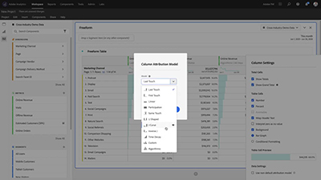

# 概述

欢迎访问 [!DNL Analytics] 教程网站。配合[文档](https://experienceleague.adobe.com/docs/analytics/landing/home.html?lang=zh-Hans)一起使用这些教程将让您更好地了解如何使用 Adobe Analytics 比以往更快地获得客户洞察。要开始教程，请
* 查看下方的&#x200B;**“新增功能”**&#x200B;部分以了解最新的实用组件
* **员工精选**&#x200B;重点介绍我们喜爱的一些内容
* 在&#x200B;**左侧导航**&#x200B;中按主题和副标题浏览内容
* 如果您知道自己在寻找什么，请使用页面顶部的&#x200B;**搜索**&#x200B;字段

## 新增功能

* **[用右键单击提高 Workspace 效率（视频）](analysis-workspace/navigating-workspace-projects/right-click-for-workspace-efficiency.md)**

    
   *了解我们喜欢的各种 Analysis Workspace 右键单击及其用法。从[!UICONTROL 自由格式表]到[!UICONTROL 流失可视化]，右键单击将使您在 [!DNL Workspace] 中更加高效和熟练。*

* **[Analysis Workspace 中的“Quick Insights”面板（视频）](analysis-workspace/using-panels/quick-insights-panel-in-analysis-workspace.md)**

    
   *Quick Insights 为非分析师和 Analysis Workspace 的新用户提供指导，帮助他们了解如何快速而轻松地回答业务问题。*

* **[Analysis Workspace 中的项目共享（视频）](analysis-workspace/curate-and-share-projects/project-sharing-in-analysis-workspace.md)**

    
   *项目共享是一种让从 Analysis Workspace 获得的数据和见解惠及组织中各个用户的方法。可根据希望接收方拥有的项目体验，为其安排三种项目角色之一：“编辑”、“复制”和“查看”。*

## 员工精选

<table>
<tr>
  <td>
    
    

      <a href="analysis-workspace/attribution-iq/algorithmic-model-in-attribution-iq.md">
    <strong>Attribution IQ 中的算法模型</strong>
    </a>
    

    

    <em>Analysis Workspace 中的“算法归因”模型使用统计学方法动态地判断为所选指标分配积分的最佳方式。</em>
    

  </td>
   <td>
    
    

      <a href="analysis-workspace/navigating-workspace-projects/training-tutorial-template-in-analysis-workspace.md">
    <strong>Analysis Workspace 中的培训教程模板</strong>
    </a>
    

    

    <em>Analysis Workspace 培训教程向用户介绍常见的术语以及在 Workspace 中构建其第一个分析的各个步骤。</em>
    

  </td>
  <td>
    
    

      <a href="analysis-workspace/analysis-workspace-basics/analysis-workspace-overview.md">
    <strong>Analysis Workspace 概述</strong>
    </a>
    

    

    <em>Analysis Workspace 的整体概述。</em>
    

  </td>
</tr>
</table>
